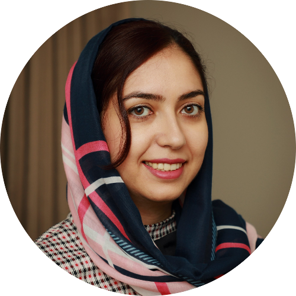
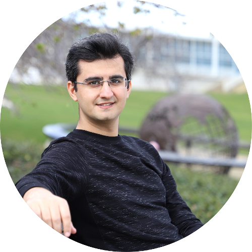

<link rel="stylesheet" type="text/css" href="css/bootstrap.min.css">
<link rel="stylesheet" type="text/css" href="css/main.css?1" media="screen,projection">

## Computer Vision Reading Groups and Tutorials, ANU-CVML
---

The CVRG and Tutorial meets weekly to discuss (mostly) recent papers in computer vision and related topics. There are also tutorial sessions, aim to introduce fundamental topics in computer vision in two/three consecutive sessions. For the reading groups, all participants are encouraged read the papers before the meeting since the presenter will only be giving an overview (15-20 minutes). The remaining time will be dedicated to the discussion of the paper, led by the presenter. For tutorials, the lecturer(s) will walk you through the main concepts, theory, and applications of the topic that will be presented.

---

### Tutorial 1: Deep Generative Models
This tutorial covers an introduction to generative models, deep autoregressive models, variational autoencoders, normalizing flows, generative adversarial networks, and energy-based models. This is a three-session tutorial provided by Fatemeh Saleh, Sadegh Aliakbarian, and Xin Yu.

  

    
    

      <a href="https://fatemeh-slh.github.io/" target="_blank">Fatemeh Saleh</a> 
        Session 1: Introduction to Generative Models, Deep Autoregressive Models 
      <button class="button button4">[Slides](assets/ANUCVML-CVRG-Tutorial1-Session1.pdf)</button>
      <button class="button button4">Video</button>
    

   

   
   

    
    

      <a href="https://sadegh-aa.github.io/" target="_blank">Sadegh Aliakbarian</a> 
      Session 2: Variational Autoencoders, Normalizing Flows 
      <button class="button button4">Slides</button>
      <button class="button button4">Video</button>
    

  

  
  

    
    

      <a href="https://sites.google.com/view/xinyus-homepage/Home" target="_blank">Xin Yu</a> 
      Session 3: Generative Adversarial Networks, Energy-based Models 
      <button class="button button4">Slides</button>
      <button class="button button4">Video</button>
    

  

### Additional Notes:
- Session 1: Introduction to Generative Models, Deep Autoregressive Models *(10 July 2020)*
- Session 2: Variational Autoencoders, Normalizing Flows *(17 July 2020)*
- Session 3: Generative Adversarial Networks, Energy-based Models *(24 July 2020)*
- Zoom Meeting: Join the meeting via [Zoom](https://anu.zoom.us/j/6449388968).
